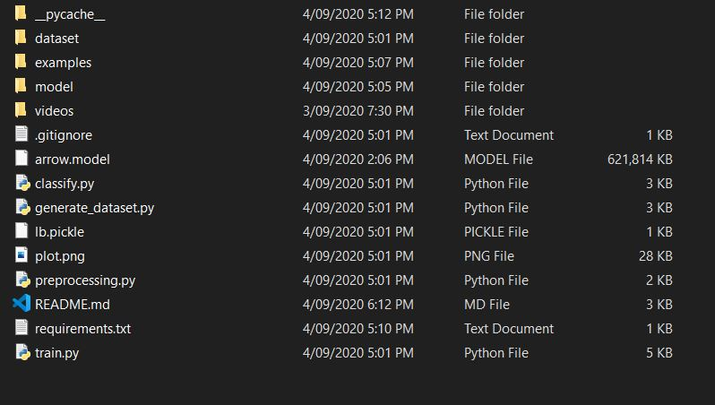

# A Fast and Accurate Object Detection Algorithm on Humanoid Marathon Robot (Hurocup Marathon)

This is a repository that implement color based region segmentation and marker detection using **Convolutional Neural 
Network(CNN)** that is used on FIRA Hurocup Marathon Game. This method able to segment out the Marker and detect its
respective direction whether left, right or forward that indicate the continuous action that need to follow by 
robot. 

# Acknowledgement
+ Thank for the paper ["A Fast and Accurate Object Detection Algorithm on Humanoid Marathon Robot"](https://doi.org/10.11591/ijeei.v8i1.1960)
which allow me to work on this repository. I would suggest you all to have a look on the paper to understand more about
the effort and work.

## Requirements
+ Python Version: 3.6.10
+ Install the require dependency with this command:
 
```
$ pip install -r requirements.txt
```

or 

```
$ pip3 install -r requirements.txt
```

Download the data from [Kaggle](https://www.kaggle.com/dataset/1f47541861bdd5136f9e22a94da35de8069ef5c0e31c3d026d65dd2e67b73962) and organize into:



I would suggest the train.py script run in the GPU environment as its tend to save your time, or you can try to run the
training at the Google Colab which provides free GPU.

## Usage
To run the classification scripts:
```
$ python classify.py --model arrow.model --labelbin lb.pickle --image examples/sample_up.png
```

To run the training scripts:
```
$ python train.py --dataset dataset --model arrow.model --labelbin lb.pickle
```

Optional:
This is used to generate the dataset by captured the frame from video to images. 
```
$ python generate_dataset.py
```

## Work
+ The CNN model architecture is created and located in ```model/marathonnet.py```
+ The color based region segmentation is under ```preprocessing.py```

## Note
I didn't implement the cross-validation strategy. Don't get me wrong, cross-validation are important to prevent model 
overfitting. Anyone are invited to submit their pull request to further improve the work.

## Reference
1. Jamzuri, E. R., Mandala, H., & Baltes, J. (2020). A fast and accurate object detection algorithm on humanoid marathon 
robot. Indonesian Journal of Electrical Engineering and Informatics, 8(1), 204-214. https://doi.org/10.11591/ijeei.v8i1.1960